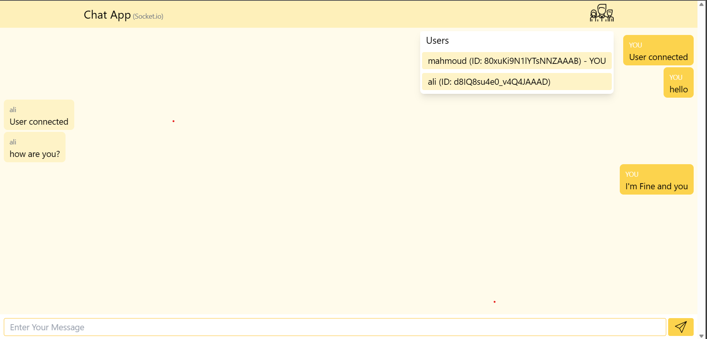

# first project

## rock-paper-scissors-lizard-spock

### Rules

- Scissors beats Paper
- Paper beats Rock
- Rock beats Lizard
- Lizard beats Spock
- Spock beats Scissors
- Scissors beats Lizard
- Paper beats Spock
- Rock beats Scissors
- Lizard beats Paper
- Spock beats Rock

### How to play

- join room or create room if you are the first player

- choose your move

- wait for the other player to choose his move

- see the result
- play again if you want or leave the room

### How to run the project

all the commands done in the root directory of the project `rock-paper-scissors` and you need to have nodejs installed on your machine

- clone the project
- run `npm install` or `yarn` to install the dependencies
- run `npm run dev` or `yarn dev` to start the game
- open `localhost:5173` in your browser

*before running the project you need to go to `src\server` and do the above steps too*

--------------------------------------------------------

# Second project

## chat app

### How to run the project

same as the first project
but root directory is `chat`

### How to use the app

- enter your name

- use the app

*you can see the other users in the room when you click on the users icon*

*you can open the app in multiple tabs to chat with yourself*
